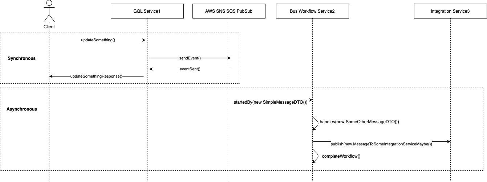

# graphql-snssqs-subscriptions

This package implements the PubSubEngine Interface from the [graphql-subscriptions](https://github.com/apollographql/graphql-subscriptions) package. Once initiated this library automatically create subscriptions between SNS and SQS by the given configuration.

```bash
npm install -g graphql-snssqs-subscriptions
```

## Usage

```typescript

// file pubsub.ts

import { SNSSQSPubSub } from 'graphql-snssqs-subscriptions';
import env from '../utils/env';

export type SNSSQSPubSubType = SNSSQSPubSub;

let awsEndpoints = {};

if (!env.SERVICE_PRODUCTION) {
  awsEndpoints = {
    sns: {
      endpoint: `${env.AWS_SNS_ENDPOINT}`,
    },
    sqs: {
      endpoint: `${env.AWS_SQS_ENDPOINT}`,
    },
  };
}

export const getPubSub = async (): Promise<SNSSQSPubSub> => {
  const pubsub = new SNSSQSPubSub(
    {
      accessKeyId: env.AWS_ACCESS_KEY_ID,
      secretAccessKey: env.AWS_SECRET_ACCESS_KEY,
      region: env.AWS_REGION,
      ...awsEndpoints,
    },
    {
      serviceName: env.SERVICE_NAME,
    }
  );
  await pubsub.init();
  return pubsub;
};


// file server.ts
const bootstrap = async () => {
  const pubSub = await getPubSub();

  const server = new ApolloServer({
    schema,
    context: (req: any): MyServiceContext => ({
      ...req,
      pubSub, // ctx.pubsub will be available in your service context
    }),
  });

  await server.listen(env.SERVICE_PORT);
  logger.info(`Service is listening on port: ${env.SERVICE_PORT}`);
};

bootstrap().catch(logger.error);
```


## Simple usage in graphql context with TypeGraphQL


```typescript
import { MessageAttributes } from 'graphql-snssqs-subscriptions';

class SimpleMessageDTO {
  readonly $name = `${env.APP_DOMAIN}/${env.MY_SERVICE_NAME}/message-subject-or-anything`;
  readonly $version = 1;

  msgDataString: string;

  constructor(msgDataString: string) {
    this.msgDataString = msgDataString;
  }
}

export class Resolver {
  Mutation(() => UpdateSomethingResponse)
  async updateSomething(
    @Ctx() ctx: MyServiceContext,
    @Arg('input') inputData: UpdateSomethigInput
  ): Promise<UpdateSomethingResponse> {

    // ... some logic...

    ctx.pubSub.publish(
      env.MY_SERVICE_NAME, // this is your topic
      new SimpleMessageDTO({
        msgDataString: 'some data in message',
      }),
      new MessageAttributes({
        correlationId: `${ctx.account.id}`,
      })
    );

    return UpdateSomethingResponse(true);
  }

  @Subscription(() => Notification, { topics: env.MY_SERVICE_NAME, nullable: true })
  simpleSubscription (@Root() { msgDataString }: NotificationPayload) {
    return { msgDataString };
  }
}
```

## Simple usage with TypeGraphQL and @node-ts/bus-workflow

- More Info on graphql framework [TypeGraphQL](https://typegraphql.ml/docs/introduction.html)
- More Info on service bus framework [@node-ts/bus](https://github.com/node-ts/bus)



```typescript
// Service1 Resover
import { MessageAttributes } from 'graphql-snssqs-subscriptions';

class SimpleMessageDTO {
  readonly $name = `${env.APP_DOMAIN}/${env.MY_SERVICE_NAME}/message-subject-or-anything`;
  readonly $version = 1;

  msgDataString: string;

  constructor(msgDataString: string) {
    this.msgDataString = msgDataString;
  }
}

export class Resolver {
  Mutation(() => UpdateSomethingResponse)
  async updateSomething(
    @Ctx() ctx: MyServiceContext,
    @Arg('input') inputData: UpdateSomethigInput
  ): Promise<UpdateSomethingResponse> {

    // ... some logic...

    // Methods publish, sendEvent, sendCommand
    ctx.pubSub.sendEvent(
      new SimpleMessageDTO({
        msgDataString: 'some data in message',
      }),
      new MessageAttributes({
        correlationId: `${ctx.account.id}`,
      })
    );

    return UpdateSomethingResponse(true);
  }
}
```

```typescript
// Service2 Workflows
//...imports
class SimpleMessageDTO {
  readonly $name = `${env.APP_DOMAIN}/${env.MY_SERVICE_NAME}/message-subject-or-anything`;
  readonly $version = 1;

  msgDataString: string;

  constructor(msgDataString: string) {
    super();
    this.msgDataString = msgDataString;
  }
}

@injectable()
export class MyWorkflow extends Workflow<MyWorkflowData> {
  constructor(
    @inject(BUS_SYMBOLS.Bus) private readonly bus: Bus,
    @inject(LOGGER_SYMBOLS.Logger) private readonly logger: Logger
  ) {
    super();
  }

  /**
   * Starts a new workflow smessage SimpleMewssageDTO is fired
   */
  @StartedBy<SimpleMessageDTO, MyWorkflowData, 'handleSimpleMessage'>(
    SimpleMessageDTO
  )
  async handlesSimpleMessage(
    event: SimpleMessageDTO,
    _: MyWorkflowData,
    messageAttributes: MessageAttributes
  ): Promise<Partial<MyWorkflowData>> {
    const { msgDataString } = event;

    this.bus.send(new SomeOtherMessageDto())

    return {
      msgDataString,
      correlationId: messageAttributes.correlationId,
    };
  }

  @Handles<
    SomeOtherMessageDto,
    MyWorkflowData,
    'someNewMessageHandler'
  >(SomeOtherMessageDto, (event, attributes) => attributes.correlationId, 'correlationId')
  someNewMessageHandler(): Partial<MyWorkflowData> {
    // Do whatever in this message handler
    this.bus.publish(new MessageToSomeIntegrationServiceMaybe());
    this.complete();
  }
}

```

## Benefits

- Automatically creates subscriptions from SNS to SQS.
- Automatically creates Dead Letter Queues.
- Automatically maps MessageAttributes
- Fully compatable with [@node-ts/bus](https://www.npmjs.com/package/node-ts) package
- Typescript Based

## Contributing

Bug reports and pull requests are welcome on GitHub at https://github.com/cto2bOpenSource/graphql-snssqs-subscriptions/issues. This project is intended to be a safe, welcoming space for collaboration, and contributors are expected to adhere to the [Contributor Covenant](http://contributor-covenant.org) code of conduct.

## License

The gem is available as open source under the terms of the [MIT License](https://opensource.org/licenses/MIT).

## Code of Conduct

Everyone interacting in the graphql-snssqs-subscriptions project’s codebases, issue trackers, chat rooms and mailing lists is expected to follow the [code of conduct](https://github.com/cto2bOpenSource/graphql-snssqs-subscriptions/blob/master/CODE_OF_CONDUCT.md).
